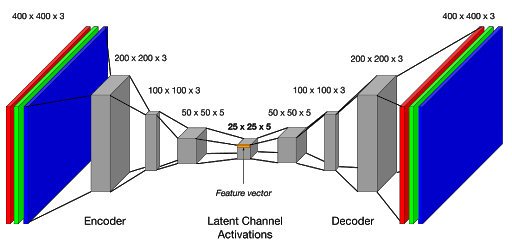

# De-Noising-Convolutional-Neural-Network

A minimal implementation of a <b>Convolution Auto-Encoder</b> in <b>TensorFlow 2.0</b> and using <b>Keras.Sequential</b>.

A convolution autoencoder takes a noisy image as a input and then produces the de-noised images as an output. The goal was to extend the already exisiting auto-encoders available for MNIST dataset and implement it for a custom dataset. 

In this repository an implementation for both the custom dataset and MNIST dataset is present. For the custom dataset, you will need to clone the complete repository while for the MNIST model you can only work with <b>model_minst_data.py</b>. 

The repository also contains how to generate the grey image patches from the dataset. The dataset which I have chosen is the ASTAR 3D dataset. It is an autonomous driving dataset. More details can be found: [here!] (https://github.com/I2RDL2/ASTAR-3D)

First I take the original images from the ASTAR-3D dataset and then create patches of 256x256 randomly and then create the grey scale patches after that to keep the computation at a bare minimum. Different scripts can be used to carry out the tasks. 

<b>Please have a look at all the files to understand the procedure</b>. I have also included the test samples I have taken from the ASTAR 3D dataset and have also generated the corresponding grayscale patches.

 

